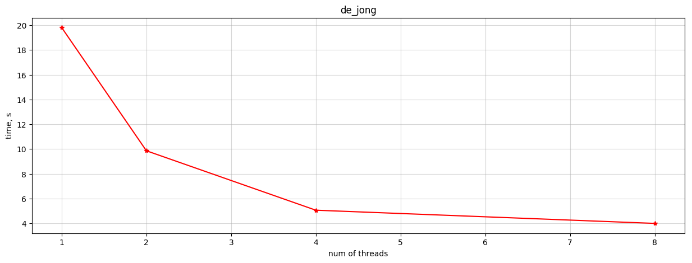

# 🦆 Parallel calculation of integrals

## How to run?
```bash
# Run calculation from yaml config 
<bin-folder>/calc_integral configs/de_jong.yaml logs/de_jong.csv

# Create plot base of calculation logs
python3 plot_logs.py logs/de_jong.csv figs/de_jong.png
```

## Results 

